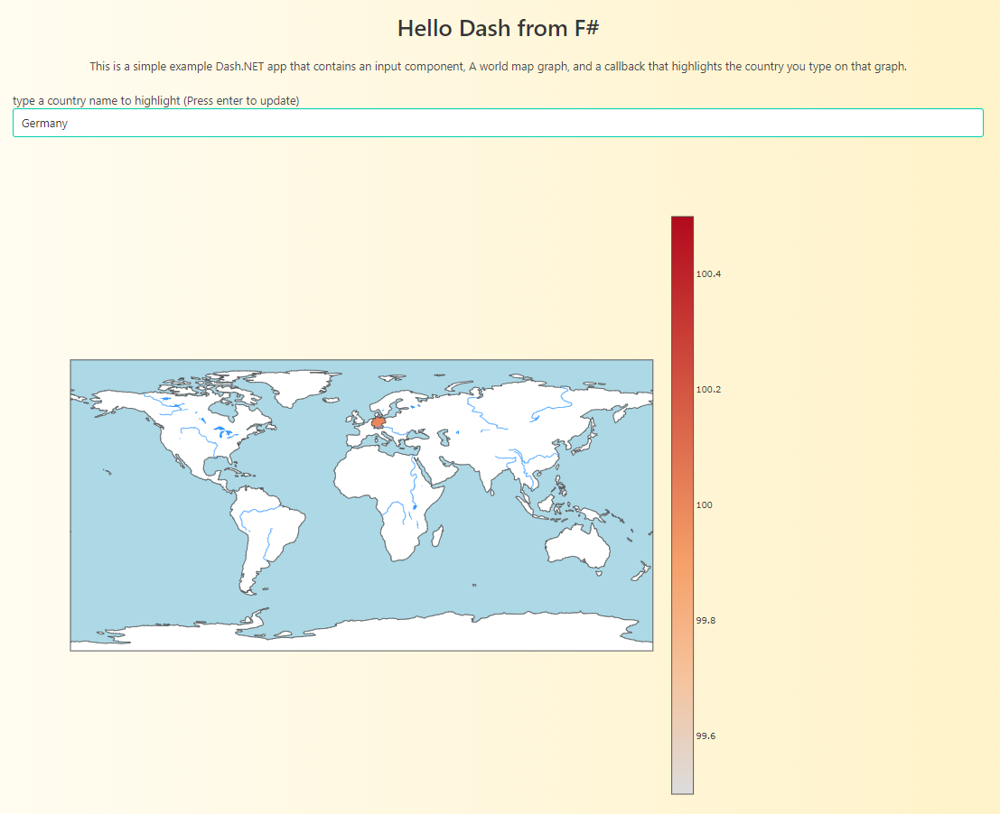

## Dash.NET.Template

A dotnet new template that gets you up and running with Dash.NET!

<div align="center">
  <a href="https://dash.plotly.com/project-maintenance">
    
  </a>
</div>

### Installation

to install the newest version of the template, use:

```PowerShell
>dotnet new -i Dash.NET.Template::*
```

to install a specific version, use:

```PowerShell
>dotnet new -i Dash.NET.Template::0.1.0
```

### Usage

To get a description of possible switches (currently none besides the default switches common to all dotnet new templates):

```PowerShell
>dotnet new dash --help
```

To initialize the template, use:

```PowerShell
>dotnet new dash
```

To run the created project:

```PowerShell
>dotnet run -p ./src/YOUR_PROJECT_NAME_HERE/YOUR_PROJECT_NAME_HERE.fsproj
```

You should be able to visit the rendered app under https://localhost:5001



To build and test the project:

```PowerShell
>build.bat
```

```PowerShell
>build.sh
```

#### Using Visual Studio

_This section is taken from the [giraffe template](https://github.com/giraffe-fsharp/giraffe-template) that is used as a base for this template_

The basic giraffe template doesn't work with IIS Express which may be the default IIS used by Visual Studio to build & publish your application. Make sure to change your drop-down (the top of your window, next to the other Configuration Manager settings) IIS setting to be the name of your project and NOT IIS Express

### Developing the template

 - You can add additional templates under the `templates` folder
 - to test templates, add them to the build script and run test.cmd
